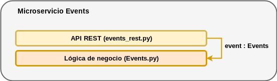

[](https://www.gnu.org/licenses/gpl-3.0)
[](https://travis-ci.com/alvarillo89/UGR-CC-Project)
[](https://codecov.io/gh/alvarillo89/UGR-CC-Project)
[](https://github.com/JJ/curso-tdd)

# Proyecto de la asignatura Cloud Computing (UGR)

Puede consultar cómo se configuró Git y Github para el proyecto en [este enlace.](https://github.com/alvarillo89/UGR-CC-Project/blob/master/docs/gitconfig.md)

## OpenEvent

`OpenEvent` es una aplicación open source que permite a organizadores de cualquier tipo publicar información sobre sus eventos y vender entradas para los mismos mediante pagos electrónicos. Todo ello a través de la nube.

### Arquitectura e Infraestructura

La aplicación se implementa siguiendo una arquitectura basada en microservicios. Puede consultar con mayor detalle la *Arquitectura e Infraestructura* del proyecto en el [siguiente enlace](https://github.com/alvarillo89/UGR-CC-Project/blob/master/docs/architecture.md).

---

### Prerrequisitos y versiones

El proyecto está implementado en Python. Para su correcto funcionamiento deberá disponer de alguna de las versiones presentes en el siguiente rango:

+ Mínima versión compatible:  3.5 
+ Máxima versión compatible:  3.8 (incluída la versión en desarrollo)

> *Nota: estas versiones se han testeado en Linux. En Windows solo se ha comprobado hasta la versión 3.7, se desconoce el comportamiento para la versión 3.8*.

Adicionalmente, deberá disponer de la herramienta `Makefile`.

---

### Herramienta de construcción

buildtool: Makefile

Este proyecto utiliza `Makefile` como herramienta de construcción. Los objetivos configurados son los siguientes:

```
make install
```

*Instala todos los requisitos (módulos de Python) necesarios para la aplicación. Alternativamente a esto puede ejecutar `pip install -r requirements.txt`*. Si desea conocer qué módulos se instalan con esta órden, consulte el fichero [**requirements.txt**](https://github.com/alvarillo89/UGR-CC-Project/blob/master/requirements.txt).

```
make test
```

Ejecuta los tests del proyecto:
+ Tests unitarios sobre el módulo `Events`.
+ Tests de integración sobre la `API REST`.
+ Tests de cobertura sobre los dos módulos anteriores.   

Para los test unitarios y de integración se ha utilizado `unittest`, simplemente porque ya está incorporado en la propia ditribución de Python y no requiere de la instalación de un módulo externo. Para los test de cobertura se ha utilizado `coverage.py`. Dicho módulo generará el archivo `.coverage` que contiene el *report* de los test de cobertura. La herramienta que desee utilizar para la visualización del reporte queda a su elección. En los tests de integración contínua se ha utilizado `Codecov`.

```
make clean
```

*Limpia el directorio del proyecto, eliminando los directorios `__pycache__` y el archivo `.coverage` resultante de los test de cobertura.*

```
make start
```

*Arranca el servicio web del microservicio `Events` utilizando [Gunicorn](https://gunicorn.org/).* Previamente a la ejecución de esta orden, deberá configurar dos variables de entorno: `HOST` conteniendo la dirección y `PORT` conteniendo el puerto. Ambas definirán el server socket al que gunicorn debe enlazarse.

> Para más información sobre los parámetros con los que gunicorn es arrancado consulte el [**fichero Makefile**](https://github.com/alvarillo89/UGR-CC-Project/blob/master/Makefile).

```
make stop
```

*Finaliza la ejecución del servicio web del microservicio `Events` y todos sus workers.*

Para más detalles, consulte el [**fichero Makefile**](https://github.com/alvarillo89/UGR-CC-Project/blob/master/Makefile), el cual contiene comentarios explicativos.

---

### Integración contínua

El proyecto utiliza dos sistemas de integración contínua diferentes: `Travis-CI` y `GitHub Actions`. Para obtener más información sobre las funciones que desempeñan cada uno de ellos, consulte el [siguiente enlace](https://github.com/alvarillo89/UGR-CC-Project/blob/master/docs/ci.md).

----

### Arquitectura por capas

El microservicio `Event` se ha implementado internamente siguiendo una arquitectura por capas. En una primera capa se encontraría la lógica de negocio del microservicio (sobre la que se ejecutan los tests unitarios) y por encima de ella se encontraría la API REST (sobre la que se ejecutan los tests de integración). Esta última tiene un objeto de la clase `Events`, el cual sirve como interfaz para acceder a los métodos de la primera capa. Para una mayor claridad, aquí se muestra una representación gráfica:



----

### Contenedor Docker

Contenedor: https://github.com/alvarillo89/UGR-CC-Project/packages/63964?version=latest

En el enlace superior puede acceder a la imagen del contenedor que contiene el microservicio `Events` junto con todas las dependencias que necesita para ejecutarse: `hug`, `gunicorn` y el intérprete de `Python` 3.6.8.

Como sistema operativo utiliza `Alpine`, famoso por ser extremadamente ligero. Cabe decir que no es esta la única imagen base con la que se ha probado, sino que se han comprobado varias imágenes diferentes para posteriormente seleccionar aquella con el menor tamaño (puesto que tampoco tenemos ningún otro criterio de selección relevante):

```None
REPOSITORY          TAG                 IMAGE ID            CREATED             SIZE
event               latest              41ae7f73ea89        37 hours ago        94.4MB
fedora-python       latest              e2163f7aecf1        38 hours ago        393MB
minideb-python      latest              a5e6dbdc1222        38 hours ago        100MB
python              3.6.8-alpine        f3e18b628c1b        5 months ago        79.3MB
python              3.6.8               48c06762acf0        5 months ago        924MB
```

El claro ganador es `Alpine` (aunque `minideb`, una distribución simple de `Debian`, es un fuerte competidor). También llama la atención que la imagen con aparentemente solo el intérprete de `Python` ocupa casi más del doble que la imagen de `Fedora`.

Por último, si desea construir la imagen a partir del archivo `Dockerfile`, ejecute el siguiente comando:

```None
docker build -t <MY TAG> --build-arg PORT=<MY PORT> .
``` 

Donde `<MY PORT>` es el puerto en el que escucharán los workers de gunicorn.

Para conocer más detalles, consulte el fichero [**Dockerfile**](https://github.com/alvarillo89/UGR-CC-Project/blob/master/Dockerfile), el cual contiene comentarios explicativos.

---

### Despliege en Heroku

[](https://heroku.com/deploy)

Una vez instalada la herramienta de comandos de interfaz de heroku (`Heroku CLI`) y tras habernos logueado en nuestra cuenta, el proceso de despliegue en heroku es sencillo:

1. Crear una aplicación de heroku tecleando `heroku create openevents`. Esto añadirá a nuestro repositorio de Git un nuevo `remote` llamado heroku. A su vez, creará la aplicación bajo el nombre `openevents`.
2. Crear el fichero `heroku.yml`, un manifest que contiene la definición de nuestra aplicación y commitearlo al repositorio. Para más información sobre su contenido, consulte el propio [**fichero**](https://github.com/alvarillo89/UGR-CC-Project/blob/master/heroku.yml), el cual contiene comentarios explicativos.
3. Establecer el stack *(la imagen del SO)* de la aplicación a `container` con el siguiente comando: `heroku stack:set container`. Con esto indicamos que se utilizará docker.
4. Pushear la imagen a heroku con el comando `git push heroku master`.

Y listo. Con esto, la aplicación estará disponible bajo la siguiente dirección:

https://openevents.herokuapp.com

Si accedemos a https://openevents.herokuapp.com/event/title/mievento podremos ver la respuesta `"Event not found"`, puesto que no existe un evento con el nombre `"mievento"`. Esto nos sirve para comprobar que funciona.

> Nota: se ha escogido heroku como PaaS por tres motivos: es gratis, es sencillo de utilizar y tenía curiosidad por trabajar con él.

