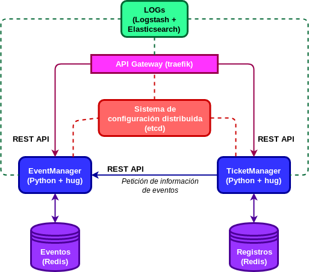

# Proyecto de la asignatura Cloud Computing (UGR)

Puede consultar la documentación adicional a la entrega del hito 0 en [este enlace.](https://github.com/alvarillo89/UGR-CC-Project/blob/master/doc/hito0.md)

## Virtual Safe Box

#### Descripción:

Se plantea la creación de una aplicación de almacenamiento en la nube, con la particularidad
de que esta actuará como una *"Caja Fuerte Virtual"*, es decir, todos aquellos archivos y
documentos que se almacenen remotamente permanecerán encriptados para brindar una seguridad 
extra al usuario. Está pensada como un lugar seguro en el que almacenar ficheros sensibles.

#### Funcionalidad:

Los usuarios deberán registrarse con un nombre de usuario y una contraseña para poder gestionar y recuperar apropiadamente todos sus archivos. Cada vez que un nuevo usuario ingresa en la plataforma, esta genera una clave única que será remitida al usuario. Dicha clave será empleada por defecto para cifrar simétricamente los distintos archivos subidos. También se ofrece la posibilidad de generar una nueva clave para cifrar un único archivo en concreto. Por supuesto, las comunicaciones entre los
distintos servicios deberán realizarse de forma segura.

#### Arquitectura:

La aplicación se implementará siguiendo una arquitectura de microservicios con comunicación basada en eventos. Los archivos subidos a la plataforma presentarán una gran variedad de tamaños y complejidades, por lo que es imposible saber a priori y con exactitud cuanto tiempo llevará encriptarlos o desencriptarlos. Para este tipo de tareas, en las que desconoce el tiempo que se tardará en completarlas, los eventos son de gran utilidad.

A continuación, se muestra una descripción  detallada de cada uno de los microservicios involucrados:

- Gestor de usuarios. Encargado de dar de alta a nuevos usuarios y verificar los inicios de sesión. Necesario para poder asociar un archivo con su correspondiente propietario.
- Encriptador. Microservicio encargado de generar las claves de cifrado simétrico, cifrar los archivos con las mismas y almacenar los ficheros en el almacén de datos.
- Desencriptador. Recibida la clave y el fichero, realiza el desencriptado del mismo para que pueda ser devuelto al usuario.

Para finalizar, aquí se muestra un grafo con la arquitectura de la aplicación:

#### Tecnologías y lenguajes:

Puesto que la comunicación entre los distintos microservicios estará basada en eventos, puede resultar interesante implementar el sistema en `Python`, para así poder hacer uso del módulo [Celery](http://www.celeryproject.org/). Dicho módulo permite gestionar una cola de tareas asíncronas basada en paso de mensajes distribuidos. Además, `Python` proporciona módulos sencillos de utilizar para la criptografía (veáse [pycrypto](https://pypi.org/project/pycrypto/)). No obstante, no se descarta realizar una implementación políglota, utilizando un segundo lenguaje para el microservicio `Gestor de usuarios`.

Finalmente, como broker de mensajería, se utilizará [RabbitMQ](https://www.rabbitmq.com/). Presenta una integración sencilla con Celery y es de los más extendidos.

#### Almacenes de datos:

Se necesita almacenar lo siguiente:

- Datos de usuarios (username y contraseña).
- Archivos subidos a la plataforma por cada usuario y que permanecen cifrados.

Puesto que no todos los archivos que almacenarán los usuarios tendrán la misma estructura, para esta aplicación resulta más útil utilizar almacenes de datos NoSQL.