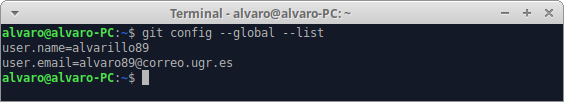
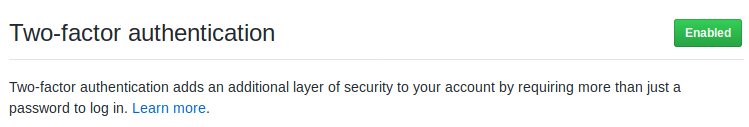
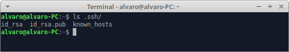
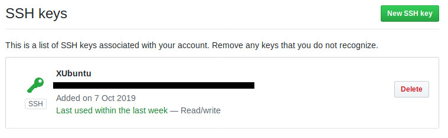

# Material complementario a la entrega del Hito 0

Este documento contiene una serie de capturas de pantalla que
justifican la configuración apropiada de Git para la asignatura.

- [X] Configuración correcta del nombre y correo electrónico para que aparezca en los commits.

- [X] Incrementar la seguridad de nuestra cuenta en GitHub activando el segundo factor de autenticación.

- [X] Creación de par de claves y subida de clave pública a GitHub.

