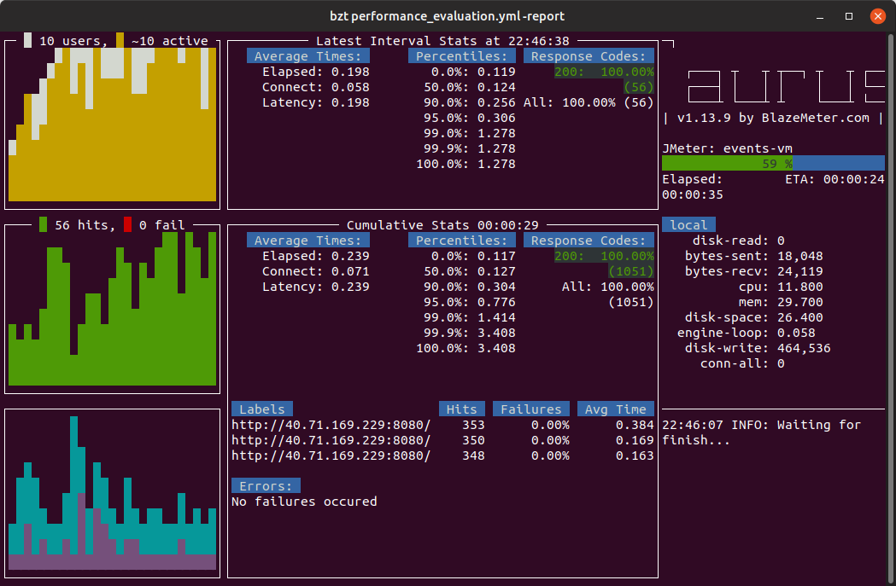
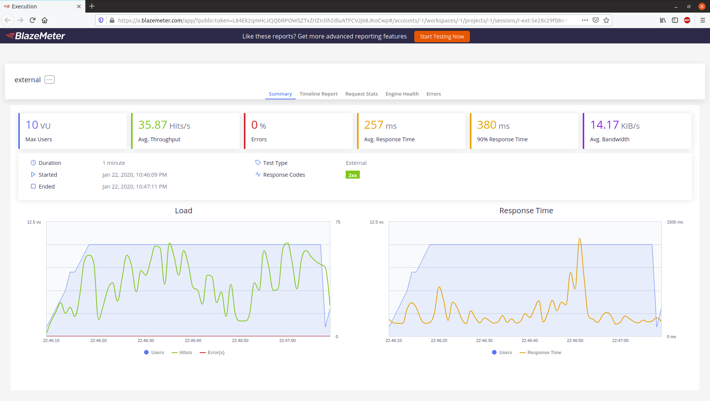
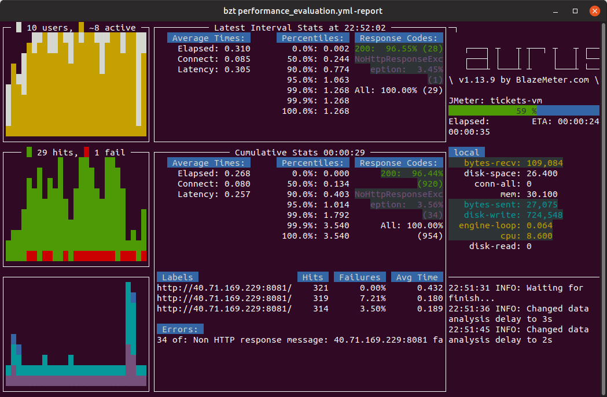
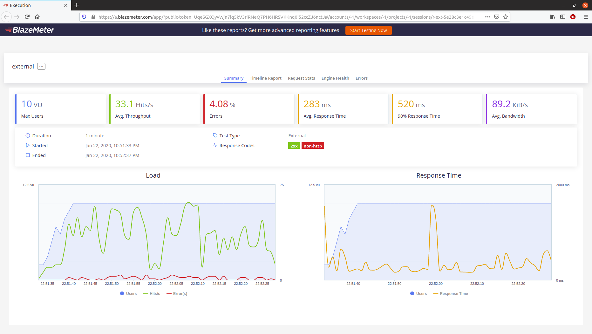
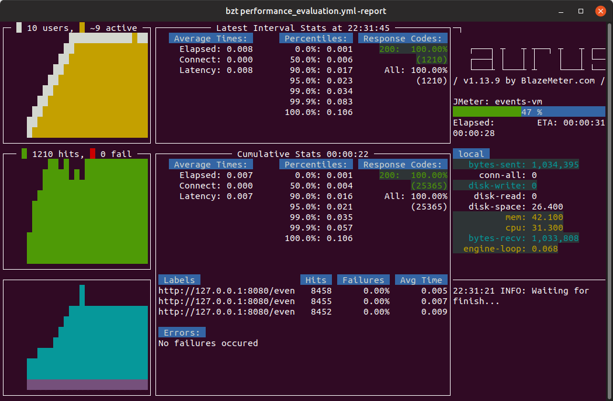
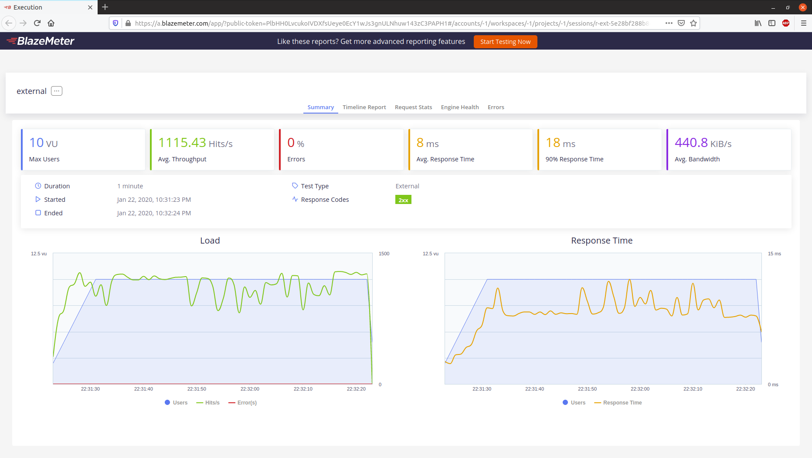
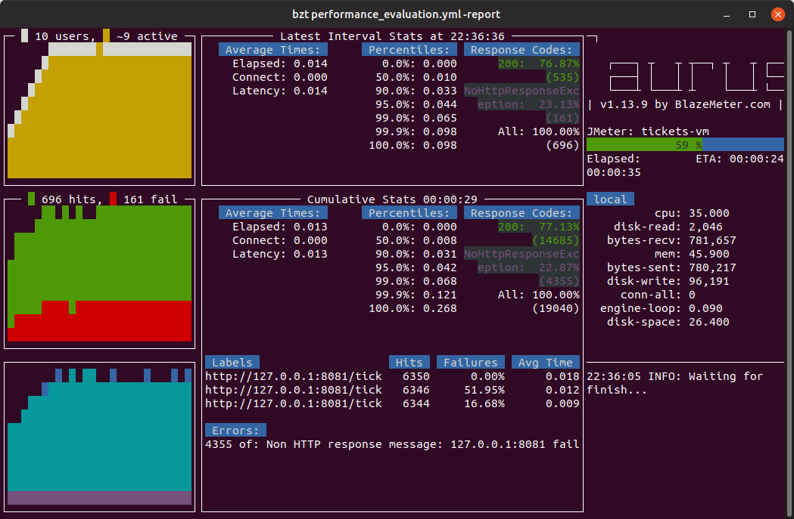
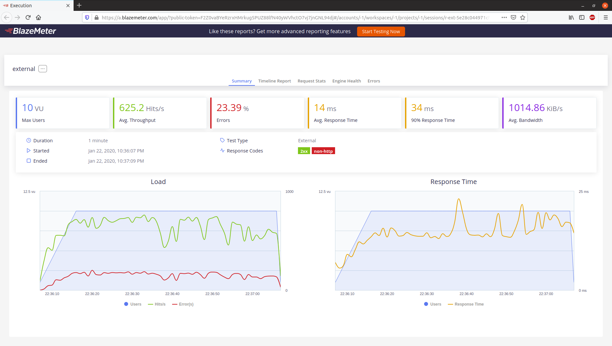

# Provisionamiento de VMs con Ansible

Una vez terminada la implementación del segundo microservicio (la cual puede consultarse con detalle a partir de [aquí](https://github.com/alvarillo89/UGR-CC-Project/blob/master/README.md#implementaci%C3%B3n-del-microservicio-tickets)), el siguiente paso del proyecto era realizar el despliegue, tanto del microservicio `Tickets`, como de `Events`.

Para el despliegue se han utilizado máquinas virtuales y, tal y como hemos mencionado en otras partes de esta documentación, para el provisionamiento y demás tareas de automatización se ha utilizado Ansible.

En este documento se describen con detalle todos los pasos seguidos para alcanzar este hito del proyecto.

---

## Establecer unas prestaciones objetivo

La primera decisión que debemos tomar antes de ponernos con el despliegue es determinar qué nivel de prestaciones consideramos como aceptables para los microservicios desplegados. En otras palabras, tenemos que fijar el nivel de rendimiento que deseamos. 

En principio, el microservicio `Events` deberá mantener los requisitos de prestaciones que establecimos para el hito anterior (mínimo 1000 peticiones por segundo). Por otro lado, puesto que el microservicio `Tickets` realiza tareas más pesadas que el otro (generar PDFs y servirlos, además de escrituras en la base de datos), consideraremos como válido un rendimiento menor, aunque nunca inferior a las 500 peticiones por segundo.

Todo lo que hagamos deberá enfocarse en mantener el nivel de prestaciones deseado.

---

## Máquinas Virtuales

Una vez establecido el nivel de prestaciones, el siguiente paso es elegir qué características tendrán las máquinas virtuales que utilizaremos para el despliegue. Se realizará el *deploy* de ambos microservicios en dos máquinas virtuales diferentes:

- Una máquina virtual local. La creación de esta máquina está definida en el [Vagrantfile](https://github.com/alvarillo89/UGR-CC-Project/blob/master/provision/Vagrantfile). Presenta las siguientes características:
    - 4GB de RAM.
    - 2 cores.
    - Ubuntu 18.04 LTS (bionic beaver) como SO.
- Una máquina virtual remota hosteada en Azure. La creación de esta máquina está definida en este [playbook de Ansible](https://github.com/alvarillo89/UGR-CC-Project/blob/master/provision/create_azure_vm.yml) (antes de ejecutarlo deberá configurar una variable de entorno llamada `SSH_KEY`, con su clave pública). Presenta las siguientes características:
    - 8GB de RAM.
    - 2 cores.
    - Ubuntu Server 18.04 como SO.

Se ha desplegado en dos sitios diferentes simplemente por realizar una comparativa de las prestaciones.

> Nota: la idea era que ambas máquinas virtuales tuviesen las mismas caraterísticas para que la comparativa fuese más justa, no obstante no ha sido posible. 8GB de RAM para la máquina local era demasiado y además, Ubuntu no ha publicado un box con Ubuntu Server 18.04. Las versiones anteriores han dejado de recibir mantenimiento y las más recientes (como la 19.10) aún no son compatibles con los roles de Ansible utilizados. Por eso se ha utilizado la versión de escritorio de Ubuntu para la máquina local.

---

## ¿Cómo se realizará el despliegue?

Puesto que ambos microservicios se estarán ejecutando en la misma máquina virtual, utilizaremos contenedores docker para el despliegue. De esta forma, facilitamos la escalabilidad. En caso de que la carga de alguno de los microservicios sea demasiado elevada, siempre se podrá levantar un segundo contenedor de ese microservicio y balancear parte de la carga hacia el mismo.

Por otro lado, `Events` y `Tickets` requieren de dos servicios: MongoDB y RabbitMQ.

Con respecto a MongoDB, ya vimos en el análisis de las prestaciones que hicimos [en hitos anteriores](https://github.com/alvarillo89/UGR-CC-Project/blob/master/docs/performance.md) que para que se obtuviese un buen rendimiento, la base de datos debía instalarse en local, por lo que instalaremos Mongo directamente en las máquinas virtuales.

Por otro lado, con respecto a RabbitMQ, y aprovechando que necesitamos instalar docker para los microservicios, utilizaremos también el contenedor docker de RabbitMQ, de esta forma evitamos realizar tediosas configuraciones.

En definitiva, cada máquina virtual ejecutará lo siguiente:
- Los contenedores docker de ambos microservicios.
- El contenedor con RabbitMQ.
- MongoDB directamente instalado en la VM.

---

## Provisionamiento

Una vez determinado el nivel de prestaciones, decidido como se van a estructurar los microservicios y creadas las máquinas virtuales, el siguiente paso es realizar el provisionamiento, es decir, instalar y colocar en las máquinas virtuales todos aquellos recursos que son necesarios para permitir el despliegue de los microservicios. En este paso es donde entra en juego Ansible.

En el [siguiente archivo](https://github.com/alvarillo89/UGR-CC-Project/blob/master/provision/ansible.cfg) puede consultar la configuración general de Ansible y en [este](https://github.com/alvarillo89/UGR-CC-Project/blob/master/provision/ansible_hosts.ini), el inventario utilizado. Ambos contienen comentarios explicativos.

El playbook [provision_vm.yml](https://github.com/alvarillo89/UGR-CC-Project/blob/master/provision/provision_vm.yml) será el encargado de realizar el provisionamiento. Estos son los pasos que realiza:

1. Instalar MongoDB y docker utilizando roles descargados desde Ansible Galaxy. Ejecute `make download` para descargar lo roles necesarios.
2. Descargar las imágenes de docker de ambos microservicios que están publicadas en [DockerHub](https://hub.docker.com/r/alvarillo89/events).
3. Descargar la imagen docker de RabbitMQ.
4. Subir a la máquina virtual los `env files` que se deberán utilizar en la ejecución de los contenedores de ambos microservicios:
    - `.env_events`: contiene las variables de entorno que necesita el microservicio `Events`: puerto y uri de la base de datos.
    - `.env_tickets`: contiene las variables de entorno que necesita el microservicio `Tickets`: puerto, uri de la base de datos y broker y backend de Celery.

> Nota: escoja como hosts `vagranbox` para provisionar la máquina local. Escoja `azure` para la máquina remota. Esto se aplica a todos los demas playbooks que se describan en este documento.

---

## Despliegue

El despliegue consiste simplemente en levantar todos los microservicios y servicios. El playbook encargado de esto es [deploy.yml](https://github.com/alvarillo89/UGR-CC-Project/blob/master/provision/deploy.yml). Los pasos que realiza son:

1. Asegurarse de que el daemon de mongo se está ejecutando. En otras palabras, comprobar que mongo se está ejecutando.
3. Levantar el contenedor de RabbitMQ.
2. Levantar el contenedor del microservicio `Events`.
3. Levantar el contenedor del microservicio `Tickets`.

Consulte el playbook para ver los parámetros con los que se ejecutan los contenedores.

Adicionalmente, se ha creado otro playbook ([stop.yml](https://github.com/alvarillo89/UGR-CC-Project/blob/master/provision/stop.yml)) que finaliza la ejecución de los contenedores (mongo no es necesario pararlo).

---

## Medición de prestaciones

Provisionadas las máquinas virtuales y desplegados los microservicios, es el momento de medir de las prestaciones para ver si se ajustan a los objetivos que fijamos. Para ello utilizaremos nuevamente `Taurus`. Se han establecido dos nuevos escenarios en el fichero [performance_evaluation.yml](https://github.com/alvarillo89/UGR-CC-Project/blob/master/performance_evaluation.yml):

- `events-vm`: mide las prestaciones del microservicio `Events`. Realiza tres peticiones de lectura (GET) de la información de tres eventos diferentes.
- `tickets-vm`: mide las prestaciones del microservicio `Tickets`. Pide dos entradas para dos eventos diferentes y consulta la validez de una entrada.

Ambos escenarios emplean 10 usuarios simultáneos que se conectan en un periodo de 10s y cada conexión se mantiene durante 50 segundos.

A continuación se muestran los resultados:

### Microservicio Events en Azure:

### Microservicio Tickets en Azure:

> Nota: en el test del microservicio `Tickets` podemos ver que se producen errores del tipo `NoHttpResponse`. Esto es un problema que presenta las versiones recientes de JMeter ([enlace al problema](https://cwiki.apache.org/confluence/display/jmeter/JMeterSocketClosed)) y posiblemente se esté produciendo por la recepción del PDF. El microservicio se ha testeado y funciona como debería.

Como podemos ver en las gráficas, el rendimiento de la máquina virtual de Azure es pésimo. `Events` solo alcanza 35.87 Hits/s y `Tickets` 33.1 Hits/s. Esto puede deberse a varios motivos:

- Por como están implementados los microservicios. Del hito anterior sabemos que al menos `Events` es capaz de alcanzar prestaciones de 2976 peticiones/s. No hemos medido las prestaciones de `Tickets`, pero la gran diferencia existente en las prestaciones del otro microservicio nos hace de dudar de que la causa sea esta.
- Las características de la VM son insuficientes. Creo que 8GB de RAM es más que suficiente para ejecutar tres contenedores de docker.
- El hecho de que se esté ejecutando en docker merma las prestaciones: compararemos con la máquina virtual local para ver si este es el motivo.
- La latencia en las comunicaciones: los tiempos de respuesta medios son de 257 y 283 ms. Además, si hacemos `ping` a la VM de Azure, obtenemos un rtt medio de 177 ms. Es un tiempo relativamente alto.
- Puede que Azure esté limitando el número de prestaciones.

Ahora mediremos las prestaciones en local y compararemos los resultados.

### Microservicio Events en local:

### Microservicio Tickets en local:

Ahora sí, las prestaciones son las esperadas. El microservicio `Events` alcanza 1115 Hits/s, lo cual supera las 1000 propuestas como objetivo (además este resultado evidencia el overhead que introducen las máquinas virtuales, pues directamente ejecutado en la máquina anfitriona obtiene mucho más).

Por su parte, `Tickets` llega hasta 625.7 Hits/s. Tal y como previmos, su redimiento es menor debido a la carga de las tareas que ejecuta, pero sigue superando las 500 peticiones/s establecidas como objetivo.

Con 4GB de RAM menos que Azure, alcanza mejores prestaciones. Esto demuestra que el problema no es de la máquina, ni de que se esté ejecutando en docker. Posiblemente, en Azure se estén obteniendo malos resultados por alguno de estos motivos:

- La latencia de las comunicaciones (me decanto por este, ya que en local el tiempo de respuesta medio es de solo 8 y 14 ms).
- Azure limita las peticiones (si que es cierto que Azure impone restricciones en función de la suscripción, aunque no he podido encontra si limita las peticiones).