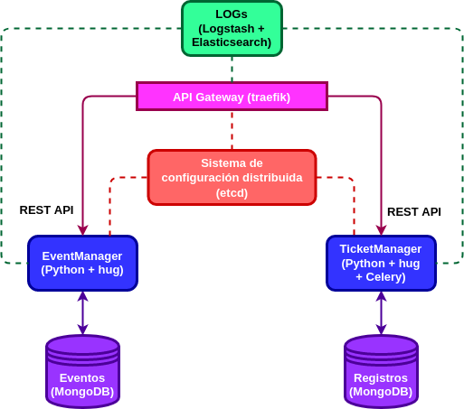
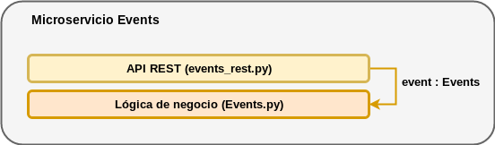
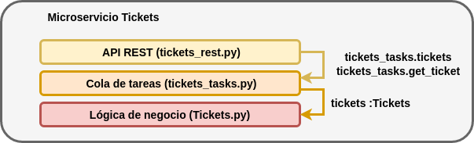

# Arquitectura de la aplicación

Cada una de las entidades extraídas en el [análisis del dominio del problema](https://github.com/alvarillo89/UGR-CC-Project/blob/master/docs/domain.md) se asociarán a un microservicio diferente: 

+ `EventManager`: este microservicio implementará todas las funcionalidades asociadas con la entidad `Evento`: creación, modificación, borrado y consulta de eventos.
+ `TicketManager`: se encargará de procesar el pago de una determinada entrada y generar el documento asociado. Al mismo tiempo, almacenará el registro de pago y el código de validación de la misma para futuras comprobaciones. 

Aquí se muestra un grafo con la arquitectura de la aplicación:

Cada microservicio dispondrá de su propia API Rest para las comunicaciones. Además, el microservicio TicketManager empleará internamente una cola de tareas para la generación de las entradas. Al fin y al cabo, no podemos saber de antemano cuanto tiempo tardará en completarse la generación del PDF. En casos como estos, es obligatorio utilizar una cola de tareas.

### Servicios:

A continuación se muestra una lista de los distintos servicios que se utilizarán para este proyecto:

- Para el sistema de logging centralizado se utilizará [Logstash](https://www.elastic.co/es/products/logstash) + [Elasticsearch](https://github.com/elastic/elasticsearch). Una de las alternativas más populares hoy día.
- Para la API Gateway se empleará [traefik](https://traefik.io/), por lo sencillo que es de utilizar, de configurar y todas las funcionalidades que ofrece. Además está especificamente diseñado para aplicaciones basadas en HTTP, como es el caso de este proyecto.
- Para el sistema de configuración distribuida se utilizará [etcd](https://etcd.io/), el cual cubre todas las necesidades requeridas para el proyecto.
- Como broker de mensajería para la cola de tareas, se utilizará [RabbitMQ](https://www.rabbitmq.com/). Es open source, y está ampliamente utilizado.

#### Almacenes de datos:

Se necesita almacenar lo siguiente:

- Datos de Eventos.
- Registros de pago de las entradas y códigos de validación para futuras comprobaciones.

Puesto que los eventos y registros se representarán internamente como diccionarios y se utilizarán archivos `json` para las comunicaciones, el uso de una base de datos orientada a documentos simplificará notablemente los procesos de almacenamiento y consulta, evitando conversiones intermedias. Para este proyecto, se utilizará una de las bases de datos `NoSQL` más conocidas: [MongoDB](https://www.mongodb.com/es).

### Lenguajes y dependencias:

Los dos microservicios se implementarán en `Python`. Se ha escogido este lenguaje porque proporciona módulos que facilitan la implementación de algunas operaciones del microservicio `TicketManager`, como la generación de códigos de barras que codifiquen el código de validación de las entradas (para lo que se usará el módulo [treepoem](https://pypi.org/project/treepoem/)) y la creación de archivos PDF (para lo que se utilizará [reportlab](https://pypi.org/project/reportlab/)).

El microservicio `EventManager` no presenta ninguna funcionalidad que sea más facil de implementar en algún otro lenguaje, por tanto y de cara a facilitar la creación de los tests, también se implementará en `Python`.

Por otro lado, para implementar las APIs Rest, se utilizará [hug](https://www.hug.rest/), un módulo que destaca por simplificar enormemente el desarrollo de APIs (sobre todo con múltiples interfaces de acceso), generando código simple, limpio y con un alto grado de eficiencia.

Por último, para no trabajar directamente con el broker de mensajería en el código, utilizaremos [Celery](http://www.celeryproject.org/), un módulo de Python que nos permitirá trabajar a alto nivel con una cola de tareas asíncrona / cola de trabajos basada en paso de mensajes distribuidos.

# Arquitectura de los microservicios

### Microservicio Events

El microservicio `Event` se ha implementado internamente siguiendo una arquitectura por capas. En una primera capa se encontraría la lógica de negocio del microservicio (sobre la que se ejecutan los tests unitarios) y por encima de ella se encontraría la API REST (sobre la que se ejecutan los tests de integración). Esta última tiene un objeto de la clase `Events`, el cual sirve como interfaz para acceder a los métodos de la primera capa. Para una mayor claridad, aquí se muestra una representación gráfica:

### Microservicio Tickets

Al igual que el microservicio descrito en el apartado anterior, el microservicio `Tickets` también se ha implementado internamente siguiendo una arquitectura por capas. No obstante, este presenta una capa adicional con respecto a su compañero: la encargada de gestionar la cola de tareas.

- En la primera capa se encontraría la lógica de negocio del microservicio `Tickets`. Es la encargada de generar las entradas y comprobar la validez de las mismas (Script [**Tickets.py**](https://github.com/alvarillo89/UGR-CC-Project/blob/master/src/Tickets.py)). 
- Por encima de ella, se encontraría la capa encargada de gestionar la cola de tareas utilizando Celery junto a RabbitMQ. Contiene la definición de la tarea para generar una entrada y, para ello, hace uso de un objeto de la clase `Tickets`, el cual sirve como interfaz para acceder a los métodos de la primera capa (Script [**tickets_task.py**](https://github.com/alvarillo89/UGR-CC-Project/blob/master/src/tickets_tasks.py)).
- La tercera y última capa contiene la API REST del microservicio. Será la que empleen los usuarios para acceder a las funcionalidades. Es la encargada de encolar la tarea de generar entradas cuando un usuario lo requiera, obtener el resultado de una determinada tarea y consultar la validez de las entradas. Para ello hace uso tanto del objeto `Tickets`, como de la tarea definida en la capa anterior (Script [**tickets_rest.py**](https://github.com/alvarillo89/UGR-CC-Project/blob/master/src/tickets_rest.py)). 
> Nota: un usuario podrá consultar el estado de su tarea a partir del id que recibe al realizar la petición de una entrada.

Finalmente, aquí se muestra un gráfico representando la arquitectura:

