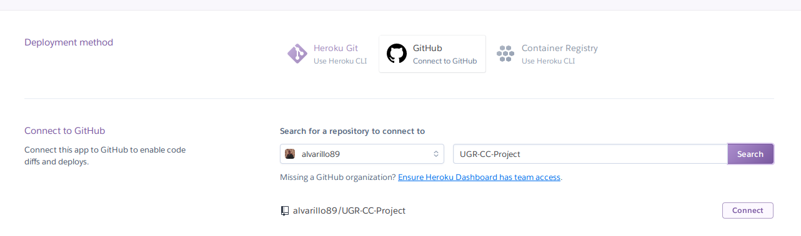
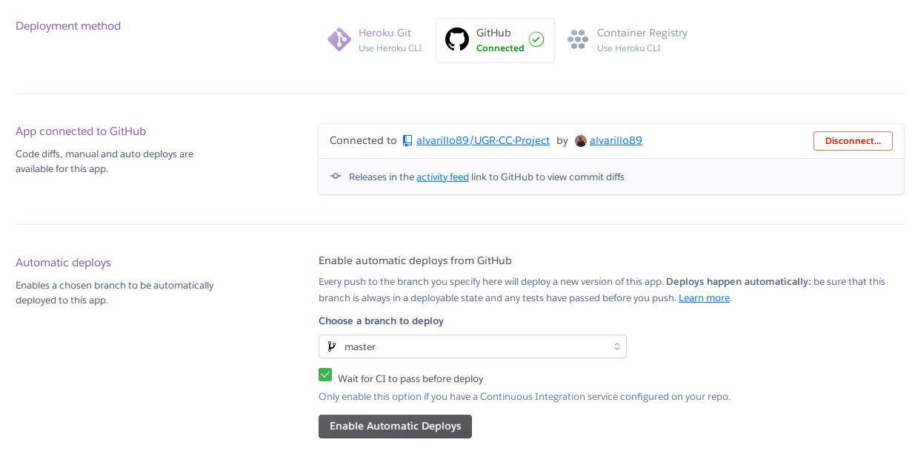
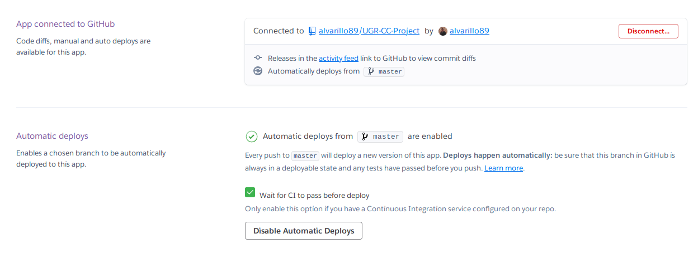

# Despliegue en Heroku

> Nota: se ha escogido heroku por cuatro motivos: es gratis, es sencillo de utilizar, su documentación es excelente y tenía curiosidad por trabajar con él.

Una vez instalada la herramienta de comandos de interfaz de heroku (`Heroku CLI`) y tras habernos logueado en nuestra cuenta, el proceso de despliegue en heroku es sencillo:

1. Crear una aplicación de heroku tecleando `heroku create openevents`. Esto añadirá a nuestro repositorio de Git un nuevo `remote` llamado heroku. A su vez, creará la aplicación de Heroku bajo el nombre `openevents`.
2. Crear el fichero `heroku.yml`, un manifest que contiene la definición de nuestra aplicación y commitearlo al repositorio. Para más información sobre su contenido, consulte el propio [**fichero**](https://github.com/alvarillo89/UGR-CC-Project/blob/master/heroku.yml), el cual contiene comentarios explicativos.
3. Establecer el stack *(la imagen del SO)* de la aplicación a `container` con el siguiente comando: `heroku stack:set container`. Con esto indicamos a Heroku que se utilizará docker.
4. Añadir las variables de entorno que necesite la aplicación con el siguiente comando: `heroku config:set <VAR>=<VALUE>`. Por ejemplo, las URLs de las bases de datos se configurarán utilizando esta instrucción.
5. Pushear la imagen a heroku con el comando `git push heroku master`.

Y listo. Con esto, la aplicación estará deplegada en la dirección especificada en el `README.md`.

El siguiente paso es, desde la página web de Heroku, conectar la aplicación al repositorio de GitHub que contiene el sistema. De esta forma, Heroku se encargará de automatizar el despliegue cada vez que se realice un push al repositorio. Las siguientes capturas muestran el proceso:

1. Conectar Github y el repositorio a la aplicación de Heroku:



2. Activamos la casilla *Wait for CI to pass before deploy* (de esta forma nos aseguramos de que la apliación no se despliega hasta que no se pasan todos los tests de integración continua) y activamos los depliegues automáticos.



3. Con esto el despliegue automático en Heroku estaría configurado:



Por último, y adicionalmente, añadiremos al `README.md` el botón de Heroku que permite realizar el despliegue fácilmente. Para ello es necesario añadir un fichero `app.json` que describa nuestra aplicación:

```json
{
    "name": "Open Events",
    "description": "Application that allows organizers to publish events and sell tickets",
    "repository": "https://github.com/alvarillo89/UGR-CC-Project",
    "keywords": ["python", "hug", "microservice"],
    "stack": "container"
}
```

El campo más relevante es `stack` que le indica a Heroku que se utilizará Docker.

*Referencias para la creación del botón:*
+ https://devcenter.heroku.com/articles/heroku-button
+ https://devcenter.heroku.com/articles/app-json-schema

---

## Enlaces de prueba:

A continuación se muestran algunos enlaces a los que se puede acceder para comprobar el funcionamiento de la aplicación desplegada:

+ Si accedemos a https://openevents.herokuapp.com/event/title/mievento podremos ver la respuesta `"Event not found"`, puesto que no existe un evento con el nombre `"mievento"`.
+ Si accedemos a https://openevents.herokuapp.com/event/title/Vega%20Jam%202019 a diferencia del anterior, si que podremos ver la informción de un evento existente (llamado `Vega Jam 2019`).