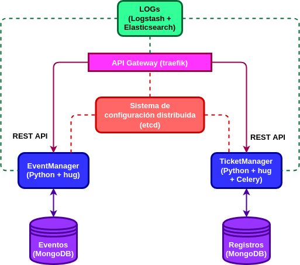

# Arquitectura de la aplicación

Cada una de las entidades extraídas en el [análisis del dominio del problema](https://github.com/alvarillo89/UGR-CC-Project/blob/master/docs/hito0-DDD.md) se asociarán a un microservicio diferente: 

+ `EventManager`: este microservicio implementará todas las funcionalidades asociadas con la entidad `Evento`: creación, modificación, borrado y consulta de eventos.
+ `TicketManager`: se encargará de procesar el pago de una determinada entrada y generar el documento asociado. Al mismo tiempo, almacenará el registro de pago y el código de validación de la misma para futuras comprobaciones. 

Aquí se muestra un grafo con la arquitectura de la aplicación:

Cada microservicio dispondrá de su propia API Rest para las comunicaciones.

### Servicios:

A continuación se muestra una lista de los distintos servicios que se utilizarán para este proyecto:

- Para el sistema de logging centralizado se utilizará [Logstash](https://www.elastic.co/es/products/logstash) + [Elasticsearch](https://github.com/elastic/elasticsearch). Una de las alternativas más populares hoy día.
- Para la API Gateway se empleará [traefik](https://traefik.io/), por lo sencillo que es de utilizar, de configurar y todas las funcionalidades que ofrece. Además está especificamente diseñado para aplicaciones basadas en HTTP, como es el caso de este proyecto.
- Para el sistema de configuración distribuida se utilizará [etcd](https://etcd.io/), el cual cubre todas las necesidades requeridas para el proyecto.

#### Almacenes de datos:

Se necesita almacenar lo siguiente:

- Datos de Eventos.
- Registros de pago de las entradas y códigos de validación para futuras comprobaciones.

Puesto que lo que nos interesa es recuperar eficientemente información (ya sea de eventos o de pagos realizados) a partir de identificadores (como puede ser el identificador del evento o el código de validación de una entrada) utilizaremos almacenes de datos basados en clave-valor. Para este proyecto, se empleará [Redis](https://redis.io/). De entre todas las funciones que ofrece, también puede utilizarse como un almacén *key-value* muy eficiente.

### Lenguajes y dependencias:

Los dos microservicios se implementarán en `Python`. Se ha escogido este lenguaje porque proporciona módulos que facilitan la implementación de algunas operaciones del microservicio `TicketManager`, como la generación de códigos de barras que codifiquen el código de validación de las entradas (para lo que se usará el módulo [treepoem](https://pypi.org/project/treepoem/)) y la creación de archivos PDF (para lo que se utilizará [reportlab](https://pypi.org/project/reportlab/)).

El microservicio `EventManager` no presenta ninguna funcionalidad que sea más facil de implementar en algún otro lenguaje, por tanto y de cara a facilitar la creación de los tests, también se implementará en `Python`.

Por último, para implementar las APIs Rest, se utilizará [hug](https://www.hug.rest/), un módulo que destaca por simplificar enormemente el desarrollo de APIs (sobre todo con múltiples interfaces de acceso), generando código simple, limpio y con un alto grado de eficiencia.