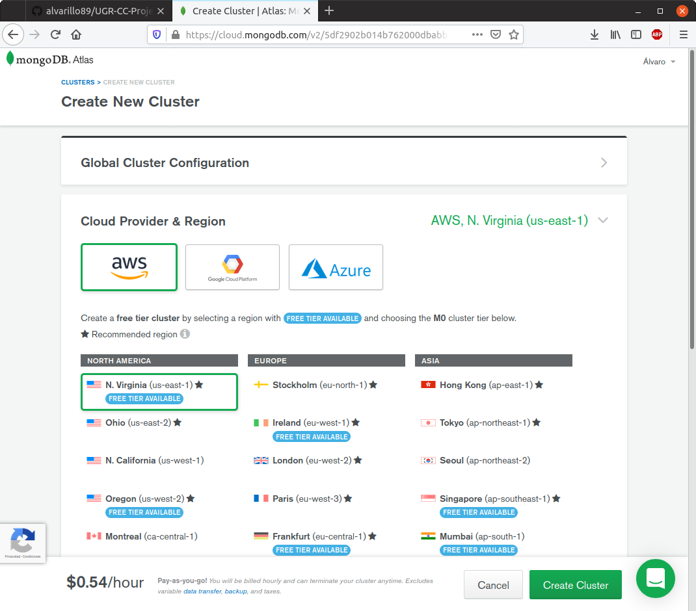

# Integración de MongoDB

Lo primero que debemos decidir es cómo vamos a integrar este servicio. Tenemos dos alternativas:

- Instalar `MongoDB` en local, es decir, construir nuestro propio servicio de mongo.
- Utilizar `MongoDB` *as a service*, es decir, utilizar algún proveedor de esta base de datos que nos permita acceder remotamente al mismo.

La primera alternativa es un poco más engorrosa por temas de instalación y configuración, pero carece de las limitaciones impuestas por el proveedor. La segunda es más sencilla de implantar, aunque como ya hemos dicho, estamos sujetos a ciertas restricciones: límite en el número de conexiones simultáneas, limite de bytes en las lecturas y escrituras, limite en el ancho de banda, etcétera.

No obstante, existe un proveedor de MongoDB (proporcionado por la propia empresa) cuyas restricciones son aceptables (512MB de almacenamiento y 500 conexiones activas) y que además ofrece un servicio gratuito. Se trata de [**MongoDB Atlas**](https://www.mongodb.com/cloud/atlas).

Puesto que tendremos que evaluar las prestaciones del microservicio más adelante (y ninguna de las dos alternativas es extramadamete costosa de implantar) probaremos con ambas opciones para quedarnos con la que mejor desempeño evidencie.

---
## Configurando MongoDB Atlas

Tras crearnos una cuenta, el siguiente paso que debemos realizar es crearnos un cluster:

Seleccionamos una de las regiones recomendadas que ofrecen servidores gratuitos y confirmamos.

Una vez creado el cluster, el último paso es crear un usuario y contraseña, configurar las IPs desde las que permitiremos las conexiones y obtener la uri que nos permitirá conectarnos a la base de datos (la cual irá a una variable de entorno llamada `DB_URI`).

Con esto, ya tendríamos acceso a la base de datos de mongo en la nube.

---

## Configurando MongoDB en local

Tras seguir el proceso de instalación y configuración para nuestra distribución ([*How to Install MongoDB 4.2 on Ubuntu 18.04 & 16.04 via PPA*](https://tecadmin.net/install-mongodb-on-ubuntu/)) ya tendremos disponible en el sistema MongoDB, el cual se ejecuta por defecto en el `localhost` bajo el puerto 27017. Si tecleamos `mongo` en la terminal, podemos acceder a su intérprete:

---

## Integrando MongoDB en el microservicio Events

El primer paso es elegir qué módulo de Python emplearemos para interactuar con la base de datos. Se ha escogido [Pymongo](https://api.mongodb.com/python/current/), ya que su uso está bastante extendido y además es el que se utiliza en los tutoriales de [w3schools](https://www.w3schools.com/python/python_mongodb_getstarted.asp).

A continuación, debemos crear la clase de Python que actuará como interfaz para trabajar con la base de datos y que utilizará el módulo descrito anteriormente. Dicha clase, llamada `MongoDataManager`, se encuentra en el [siguiente script](https://github.com/alvarillo89/UGR-CC-Project/blob/master/src/mongo_data_manager.py). Contiene métodos para realizar las operaciones básicas de una base de datos: consultar, insertar, borrar y modificar (las llamadas operaciones CRUD). También se han creado sus correspondientes [tests](https://github.com/alvarillo89/UGR-CC-Project/blob/master/tests/test_mongo_dm.py).

Por último, mediante el principio de **inyección de dependencias**, inyectamos el objeto `MongoDataManager` en la clase [Events](https://github.com/alvarillo89/UGR-CC-Project/blob/master/src/Events.py) en el momento de la construcción. Con esto conseguimos que la clase `Events` utilice de forma abstracta el objeto que maneja la base de datos, independientemente de la implementación que haya por debajo. Si en el futuro deseamos cambiar la base de datos por otra (por ejemplo, una basada en SQL) solo deberíamos programar la clase que haga uso de SQL con la misma interfaz/métodos que la clase `MongoDataManager` e inyectarla en la clase `Events`. El microservicio no será consciente de este cambio.

> **Nota:** Deberá configurar una variable de entorno llamada `DB_URI` que contenga la uri de la base de datos a la que se conectará el microservicio. En nuestro caso será la que nos proporcione Atlas o la uri local (depende de qué queramos utilizar).

---

## Incorporando los cambios en la integración contínua

Puesto que ahora nuestro microservicio utiliza MongoDB, habrá que reconfigurar Travis, GitHub Actions, el Dockerfile y Heroku para que tengan en cuenta esta modificación:

- Para Travis, debemos incorporar en el fichero [.travis.yml](https://github.com/alvarillo89/UGR-CC-Project/blob/master/.travis.yml) que se requiere del servicio mongo. Además, en la página web, se debe configurar una variable de entorno llamada `DB_URI`, con la uri de la base de datos local.
- En GitHub Actions añadiremos un nuevo `secret` llamado `DB_URI` con la uri proporcionada por Atlas. En esta plataforma de integración contínua aún no se ha incorporado el servicio de mongo, por lo que, para evitar su instalación manual en el [workflow](https://github.com/alvarillo89/UGR-CC-Project/blob/master/.github/workflows/WindowsTest.yml), utilizaremos la base de datos remota para los test. 
- En el [Dockerfile](https://github.com/alvarillo89/UGR-CC-Project/blob/master/Dockerfile), añadiremos un nuevo `ENV DB_URI` e instalamos `pymongo` junto con `dnspython` (un módulo adicional requerido por `pymongo`).
- En Heroku, configuraremos la variable de entorno `DB_URI` mediante el siguiente comando: `$ heroku config:set DB_URI=<value>`.

Con estos pasos, el cambio estaría incorporado al proceso de integración contínua. 