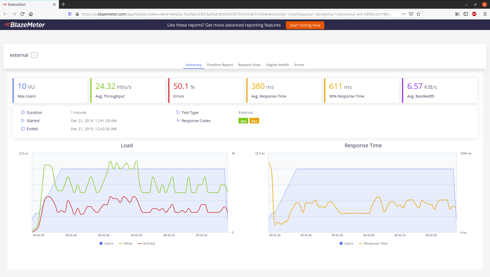
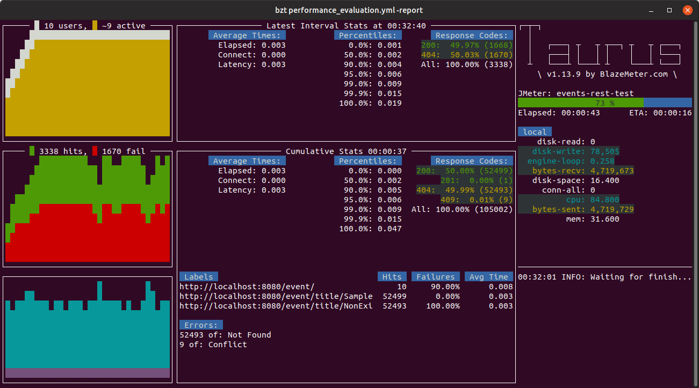

# Evaluación de prestaciones con Taurus

El primer paso para evaluar las prestaciones, es crear el fichero YAML que contendrá la definición de las pruebas de carga que realizará Taurus. Dicha definición puede encontrarse en el fichero [**performance_evaluation.yml**](https://github.com/alvarillo89/UGR-CC-Project/blob/master/performance_evaluation.yml) el cual contiene comentarios explicativos. A modo de resumen, realiza lo siguiente:

- El servidor está arrancado en local.
- Emplea 10 usuarios simultáneos que se conectan en un periodo de 10s.
- Cada conexión se mantiene durante 50 segundos.
- Realiza las siguientes peticiones
    - Una petición POST de un evento. Solo se realiza una por hebra porque, como no puede haber más de un evento con el mismo título, solo será existosa la primera que se realice. Todas las demás devolverán 409 (error en los datos enviados).
    - Dos peticiones GET:
        - Una del evento insertado anteriormente con el POST.
        - Otra de un evento que no existe (devolverá 404).

Hecho este fichero, pasaremos a las pruebas.

---

## Prueba 1: ejecutando el test sobre la configuración existente de hitos anteriores

Para este primer test, ejecutaremos el microservicio con la configuración que teníamos de hitos anteriores:
    
- 4 workers de gunicorn.

Además, utilizaremos Mongo Atlas (servidor remoto) para la base de datos.

Las siguientes capturas muestran los resultados:

Como puede observarse, las respuestas que se producen son las esperadas: un solo POST correcto (código 201) y todos los demás erróneos (409); la mitad de los GET correctos (código 200) y la otra mitad incorrectos (404). 

Solo obtenemos 24 peticiones/s con un tiempo medio de respuesta de 380ms, un resultado que no está ni de lejos cercano al rendimiento que deseamos.

La primera modificación que realizaremos será cambiar el tipo de worker de Gunicorn y aumentar el número de copias de los mismos:

- Si deseamos mantener a 10 usuarios simultáneos, debemos establecer un worker por cada uno de ellos. En consecuencia, aumentaremos su número de 4 a 10.
- Por defecto, Gunicorn utiliza workers síncronos, es decir, cada petición bloquea al proceso. En principio, alcanzaríamos mejores resultados si los workers fueran asíncronos (no bloqueantes). Esto lo podemos conseguir cambiando el tipo de workers que se utilizan con el parámetro `--worker-class` en la ejecución de Gunicorn. De entre todos los valores que puede recibir esta clase, hemos elegido [gevent](http://www.gevent.org/), un módulo de redes concurrentes para Python, el cual nos proprociona workers asíncronos.

Hechas estas modificaciones (las cuales pueden verse en el [Makefile](https://github.com/alvarillo89/UGR-CC-Project/blob/master/Makefile)), repetimos los tests.

---

## Prueba 2: 10 workers asíncronos

La configuración para este experimento es la siguiente:

- Gunicorn con 10 workers asíncronos.
- Mongo Atlas (servidor remoto) para la base de datos.

Los resultados son los siguientes:

Es indudable que esto constituye una mejora. De 24 peticiones/s hemos pasado a 71 y el tiempo de respuesta se ha reducido de 380ms a 130. No obstante, seguimos muy lejos de las 1000 peticiones/s requeridas.

Todo nos indica que el servicio se está saturando, lo que impide atender a más usuarios por segundo. Posiblemente esta saturación esté relacionada con la latencia que existe en la conexión a la base de datos remota. Un indicio de esto lo podemos encontrar en los [test de mongo](https://github.com/alvarillo89/UGR-CC-Project/blob/master/tests/test_mongo_dm.py):

- Tiempo que tardan en ejecutarse para la base de datos remota: 12.345s.
- Tiempo que tardan en ejecutarse para la base de datos local: 0.019s.

La diferencia entre uno y otro es abismal. Por tanto, para el siguiente experimento probaremos con la base de datos local.

---

## Prueba 3: MongoDB en local

La configuración para este experimento es la siguiente:

- Gunicorn con 10 workers asíncronos.
- MongoDB instalado en local.

Los resultados son los siguientes:

Efectivamente, el problema de rendimiento estaba relacionado con la latencia de la base de datos remota. Con la base de datos instalada en local alcanzamos 2976 peticiones/s (muy por encima de las 1000 peticiones/s que esperabamos) y un tiempo de respuesta medio de tan solo 2ms.

---

## Conclusión

La siguiente tabla muestra un resumen:

| Nº Workers | Tipo de worker | Base de datos | Peticiones/s | Tiempo de respuesta |
|:----------:|:--------------:|:-------------:|:------------:|:-------------------:|
|      4     |    Síncrono    |     Remota    |     24.32    |        380ms        |
|     10     |    Asíncrono   |     Remota    |     71.76    |        130ms        |
|     10     |    Asíncrono   |     Local     |    2976.33   |         2ms         |

De la misma podemos sacar las siguientes conclusiones:

- Es recomendable fijar apropiadamente el número de workers que necesitamos, por ejemplo, uno por cada usuario simultáneo que deseemos atender.
- Es recomendable que estos workers sean asíncronos.
- Hay que prestar especial cuidado a la latencia que existe en el acceso a la base de datos. Esta debe ser lo más rápida posible y una forma de conseguirlo es que sea local al sistema en el que se está ejecutando el servicio web del microservicio. 